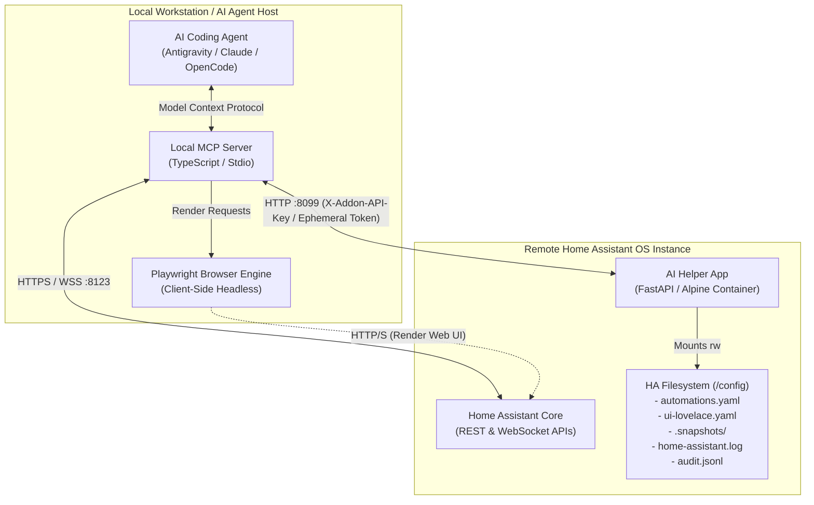

# Home Assistant AI Helper (`ha-ai`)

[](https://opensource.org/licenses/Apache-2.0)
[](https://www.typescriptlang.org/)
[](https://www.python.org/)
[](https://fastapi.tiangolo.com/)
[](https://playwright.dev/)
[](https://www.npmjs.com/package/ha-ai-mcp-server)
[](https://my.home-assistant.io/redirect/supervisor_add_addon_repository/?repository_url=https%3A%2F%2Fgithub.com%2Fsserhii-tech%2Fhome-assistant-mcp)
[](https://github.com/sserhii-tech/home-assistant-mcp/actions/workflows/ci.yml)

> **Lightweight, paranoid-secure Home Assistant MCP Server and OS App with client-side Playwright visual feedback for autonomous AI agents.**

---

## Overview

The `ha-ai` platform enables autonomous AI coding agents (such as Antigravity, Gemini CLI, Claude Code, OpenCode, and Cursor) to safely inspect, configure, iterate on, and visually validate a remote Home Assistant instance.

### Primary Capabilities
- 👁️ **Visual Dashboard Iteration**: Render Lovelace dashboards headlessly via client-side Playwright, capture full or card-level screenshots across desktop, tablet, and mobile viewports, and visually iterate until UI design is perfected.
- ⚡ **Full Lifecycle Automation & Script Authoring**: Safely read, write, validate, and trigger automations and scripts with automatic syntax checks and zero-downtime service reloads.
- 🛡️ **Paranoid Security**: Strict path jailing within `/config`, constant-time API key verification, automatic secret redaction, and zero unauthorized command execution.
- 🪶 **Minimal Server Footprint**: Lightweight Python FastAPI container running as a Home Assistant OS App (< 35MB RAM, ~0% idle CPU) with zero heavy browser or ML dependencies on the HA host.
- 🔄 **Atomic Snapshots & One-Click Rollback**: Automatic pre-edit snapshots created before every file modification, with instant atomic rollback capabilities.

---

## Architecture



---

## Security & Safety Highlights

| Security Guard | Implementation | Protection |
| :--- | :--- | :--- |
| **Path Traversal Jail** | `os.path.realpath` canonicalization inside `/config` | Prevents access to `/etc/shadow`, root system files, or container host escape (`403 Forbidden`). |
| **Constant-Time Auth** | `hmac.compare_digest` for `X-Addon-API-Key` | Eliminates timing-attack vulnerabilities against app API authentication. |
| **Deny-List Protection** | File path blocking on `secrets.yaml`, `.storage/core.auth`, `*.pem`, SSH keys | Protects sensitive user credentials and tokens from being read or overwritten. |
| **Secret Redaction** | Regex redaction filters on log streaming | Automatically sanitizes passwords, long-lived tokens, and API keys from tail logs. |
| **Atomic Pre-Edit Snapshots** | Automated `.snapshots/` creation before writes | Guarantees safe rollback to the exact prior disk state upon syntax or runtime errors. |
| **Role-Based Access Control** | Ephemeral token issuance with strict policy bounds (`ha_agent_list_policies`) | Restricts AI subagents to explicit tool, file, and service boundaries, limiting blast radius. |
| **Audit Logging Service** | Append-only JSONL event logging across API endpoints (`ha_audit_get_logs`) | Provides immutable, queryable records of all AI actions, blocked attempts, and operational rationale. |

---

## Quickstart

### 1. Prerequisites
- **Node.js 20+** and **npm** installed locally.
- **Python 3.11+** with `uv` (for running app tests locally).
- Running **Home Assistant OS** instance.

### 2. Installation & Build

```bash
# Clone the repository
git clone https://github.com/sserhii-tech/home-assistant-mcp.git
cd home-assistant-mcp

# Install root dependencies
npm install

# Build the TypeScript MCP server
npm run build
```

### 3. Developer Workflows & Commands

```bash
# Local Development: Start App daemon with hot-reloading on :8099
npm run dev:addon

# Local Development: Start MCP server in TypeScript watch mode
npm run dev:mcp

# Run full test suites (TypeScript Vitest & Python Pytest)
npm test
npm run test:addon

# Synchronize versions across all manifests and code atomically
npm run version:bump patch   # e.g. 0.1.0 -> 0.1.1
npm run version:bump minor   # e.g. 0.1.0 -> 0.2.0
npm run version:bump 1.0.0   # explicit version target
```

---

## MCP Tools Reference

The server exposes 15 specialized tools under the Model Context Protocol:

### 📊 Dashboard Tools
| Tool Name | Parameters | Description |
| :--- | :--- | :--- |
| `ha_dashboard_get_config` | `dashboard_slug?` | Retrieve Lovelace dashboard configuration via WebSocket or storage file. |
| `ha_dashboard_save_config` | `config_yaml`, `dashboard_slug?`, `label?` | Validate YAML schema, trigger automatic safety snapshot, and commit dashboard updates. |
| `ha_dashboard_render_screenshot` | `url_path`, `device_preset?`, `dark_mode?`, `element_selector?` | Render high-resolution PNG screenshot via Playwright (presets: `desktop`, `tablet`, `mobile`). |

### ⚙️ Automation & Script Tools
| Tool Name | Parameters | Description |
| :--- | :--- | :--- |
| `ha_automation_list` | `domain?` (`automation`, `script`, `scene`) | List active automations/scripts with entity IDs, friendly names, and trigger times. |
| `ha_automation_read` | `automation_id` | Fetch the exact YAML definition of a specific automation or script. |
| `ha_automation_write` | `automation_id`, `yaml_code`, `label?` | Validate YAML syntax, snapshot file, update automation block, and trigger service reload. |
| `ha_automation_trigger` | `entity_id` | Manually trigger an automation or script entity to verify execution. |

### 🛠️ System, Diagnostics & Safety Tools
| Tool Name | Parameters | Description |
| :--- | :--- | :--- |
| `ha_system_health` | *(none)* | Check health and connectivity of both Home Assistant Core and the App daemon. |
| `ha_system_list_entities` | `domain_filter?`, `search_query?` | Search and filter entities by domain (e.g. `light`, `sensor`, `climate`) with full attributes. |
| `ha_system_call_service` | `domain`, `service`, `service_data?` | Invoke any Home Assistant domain service (e.g. `light.turn_on`, `switch.toggle`, `climate.set_temperature`). |
| `ha_system_get_logs` | `lines_count?` (default: 100) | Retrieve the last $N$ lines of Home Assistant core logs with automatic secret redaction. |
| `ha_system_create_backup` | `label` | Create a named manual snapshot backup in `/config/.snapshots/`. |
| `ha_system_restore_backup` | `snapshot_id` | Atomically restore a file from a snapshot ID with safety backup preservation. |

### 🔐 Security, Audit & Agent Management
| Tool Name | Parameters | Description |
| :--- | :--- | :--- |
| `ha_audit_get_logs` | `agent_id?`, `role?`, `status?`, `limit?`, `since?`, `rationale?` | Query immutable JSONL audit logs for security, troubleshooting, and compliance filtering by agent, role, or status. |
| `ha_agent_issue_token` | `agent_id`, `role`, `ttl_minutes?`, `rationale?` | Issue a short-lived ephemeral token dynamically scoped to specific RBAC role boundaries (default 60m TTL). |
| `ha_agent_list_policies` | *(none)* | Retrieve all active RBAC agent roles, their tool permissions, path restrictions, and service whitelists. |

---

## AI Skill Pack (`skills/`)

This repository includes 4 production-ready AI agent skills:

- 🎮 **[`ha-device-controller`](skills/ha-device-controller/SKILL.md)**: Standard Operating Procedure for querying entity states, executing domain service requests (lights, switches, climate, media), and verifying post-execution state transitions.
- 🎨 **[`ha-dashboard-designer`](skills/ha-dashboard-designer/SKILL.md)**: Standard Operating Procedure for entity discovery, Lovelace card drafting, responsive layout verification, and iterative screenshot-based visual feedback loops.
- 🔧 **[`ha-automation-builder`](skills/ha-automation-builder/SKILL.md)**: Standard Operating Procedure for drafting automations, validating trigger conditions, safe saving with automatic reloads, and log trace verification.
- 🚨 **[`ha-troubleshooter`](skills/ha-troubleshooter/SKILL.md)**: Safety SOP for diagnosing integration errors, analyzing sanitized logs, and triggering immediate rollback restorations.

---

## Documentation

For full installation instructions, app configuration, agent integration guides (Antigravity, Gemini CLI, Claude Desktop, OpenCode, Cursor), and network architecture details, see:

📖 **[Full Installation & Setup Guide](docs/setup-guide.md)**

---

## License

This project is licensed under the Apache License, Version 2.0. See [LICENSE](LICENSE) for details.
