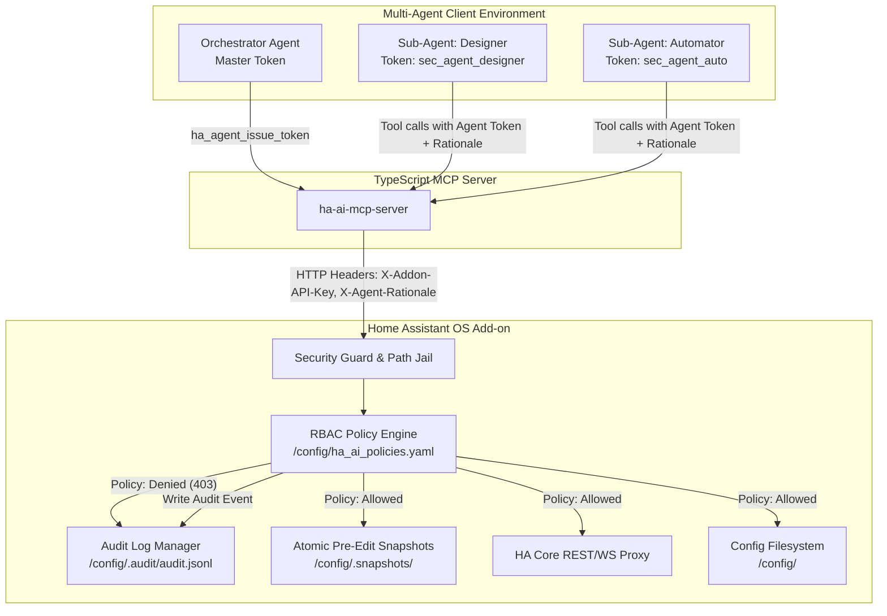
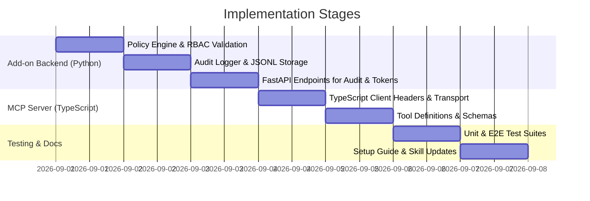

# Design Document: Sub-Agent Principals, Sandboxing Policies, and Structured Audit Logs

- **Date**: 2026-09-01
- **Status**: Validated Design Spec
- **Target Repository**: `home-assistant-mcp`
- **Subsystems Affected**:
  - `ha-mcp-helper` (FastAPI Add-on: Policy Engine, RBAC Matcher, Audit Logger)
  - `mcp-server` (TypeScript MCP Server: Scoped Agent Client, Tools & CLI)
  - `skills/` (Updated AI Skills with Agent Role & Rationale conventions)

---

## 1. Executive Summary & Goals

As multi-agent coding environments (Antigravity, Claude Code, Cursor, OpenCode, CopilotKit, LangGraph) delegate specific Home Assistant tasks to specialized sub-agents (e.g. Dashboard Designers, Automation Builders, Diagnostics Monitors), granting all sub-agents full shared root credentials poses significant risks of configuration drift, accidental state modifications, and untraceable security actions.

This design introduces:
1. **Sub-Agent Principals & Role-Based Access Control (RBAC)**: Fine-grained sandboxing enforced at the Add-on boundary by evaluating tokens against human-editable policies in `/config/ha_ai_policies.yaml`.
2. **Strict Action Validation & Explanatory Rejections**: Instant `403 Forbidden` response with clear rationale when an action is blocked by policy.
3. **Structured Append-Only Audit Logging (`/config/.audit/audit.jsonl`)**: High-performance JSON Lines audit trail recording agent identity, role, action, target entity/path, permission rationale, snapshot ID, and outcome.
4. **Dynamic Ephemeral Tokens (`ha_agent_issue_token`)**: Enabling parent orchestrators to issue time-bounded tokens for temporary sub-agents.
5. **Action Rationale Tracking**: Capturing why an action or modification was requested across all mutations.

---

## 2. Architecture & Security Model



### 2.1 Authentication & Principal Resolution
1. **Master Key**: The primary `api_key` configured in the Add-on settings retains full unrestricted access (maps to the built-in `admin` role).
2. **Agent Scoped Tokens**: Tokens starting with `sec_agent_` map to specific agent identities defined in `/config/ha_ai_policies.yaml` or issued dynamically.
3. **Constant-Time Verification**: Tokens are verified using `hmac.compare_digest` against configured agent hashes to prevent timing attacks.
4. **Header Protocol**:
   - `X-Addon-API-Key`: Master key or scoped agent token.
   - `X-Agent-Rationale`: Optional string describing user request / intent behind the mutation.

---

## 3. Policy Configuration Schema (`/config/ha_ai_policies.yaml`)

The policy engine evaluates permissions against a declarative YAML document placed in the Home Assistant `/config` root.

```yaml
version: "1.0"

roles:
  admin:
    description: "Full unrestricted administrative access"
    allow_tools: ["*"]
    allow_paths: ["*"]
    allow_services: ["*"]

  dashboard_designer:
    description: "Lovelace visual UI designer"
    allow_tools:
      - "ha_dashboard_*"
      - "ha_system_list_entities"
      - "ha_audit_get_logs"
    allow_paths:
      - "dashboards/**"
      - "ui-lovelace.yaml"
    deny_tools:
      - "ha_automation_*"
      - "ha_system_call_service"
      - "ha_system_restore_backup"

  automation_builder:
    description: "Automation and script authoring"
    allow_tools:
      - "ha_automation_*"
      - "ha_system_list_entities"
      - "ha_system_get_logs"
      - "ha_audit_get_logs"
    allow_paths:
      - "automations.yaml"
      - "scripts.yaml"
      - "scenes.yaml"
    deny_tools:
      - "ha_dashboard_save_config"

  device_operator:
    description: "Appliance and climate control"
    allow_tools:
      - "ha_system_list_entities"
      - "ha_system_call_service"
      - "ha_audit_get_logs"
    allow_services:
      - "light.*"
      - "switch.*"
      - "climate.*"
      - "media_player.*"
      - "fan.*"
    deny_services:
      - "lock.*"
      - "alarm_control_panel.*"
      - "homeassistant.restart"

  auditor_readonly:
    description: "Read-only system inspector"
    allow_tools:
      - "ha_system_list_entities"
      - "ha_system_health"
      - "ha_system_get_logs"
      - "ha_audit_get_logs"
      - "ha_dashboard_get_config"
      - "ha_automation_read"
    deny_tools:
      - "*_write"
      - "*_save*"
      - "*_restore*"
      - "ha_system_call_service"

agents:
  designer_bot:
    role: "dashboard_designer"
    token: "sec_agent_designer_9a8b7c"
    description: "Dedicated sub-agent for Lovelace views"

  automation_bot:
    role: "automation_builder"
    token: "sec_agent_auto_1d2e3f"
    description: "Dedicated sub-agent for automations"
```

### Policy Evaluation Rules:
1. **Deny Precedence**: If a requested operation matches both an `allow` and a `deny` rule, `deny` unconditionally wins.
2. **Glob Pattern Matching**: Supports `fnmatch` wildcard pattern matching across tools (`ha_dashboard_*`), file paths (`dashboards/**`), and services (`light.*`).
3. **Defense-in-Depth Jail**: Hardcoded secret deny-lists (`secrets.yaml`, `.storage/core.auth`, SSL/SSH keys) cannot be overridden even if a role specifies `allow_paths: ["*"]`.

---

## 4. Structured JSONL Audit Logging

### 4.1 Storage & Rotation
- **File Path**: `/config/.audit/audit.jsonl`
- **Format**: JSON Lines (one atomic JSON object per line).
- **Rotation**: Automatically rotated to `audit.jsonl.1` when size exceeds 10MB to maintain a minimal disk footprint.

### 4.2 Schema Definition
```json
{
  "id": "aud_20260901_105520_a1b2",
  "timestamp": "2026-09-01T10:55:20.123Z",
  "agent_id": "designer_bot",
  "role": "dashboard_designer",
  "action": "file_write",
  "tool": "ha_dashboard_save_config",
  "target": "dashboards/living_room.yaml",
  "status": "allowed",
  "reason": "Permitted by allow_paths ['dashboards/**']",
  "rationale": "Adding living room climate tile and energy gauge",
  "snapshot_id": "snap_20260901_105520_living_room_yaml",
  "client_ip": "192.168.1.50"
}
```

### 4.3 Violation Rejection Sample (HTTP 403)
```json
{
  "error": "ForbiddenByPolicy",
  "message": "Action 'service_call:lock.unlock' blocked for agent 'designer_bot' (role 'dashboard_designer').",
  "audit_id": "aud_20260901_105535_c3d4",
  "rule_violated": "Tool 'ha_system_call_service' is denied for role 'dashboard_designer'"
}
```

---

## 5. Tool Specifications & APIs

### 5.1 New Tools

#### `ha_audit_get_logs`
Query and filter the structured audit trail.
- **Input Parameters**:
  - `agent_id?: string`: Filter by specific agent identifier.
  - `role?: string`: Filter by role name.
  - `status?: "all" | "allowed" | "denied_policy" | "denied_security"`: Filter by outcome.
  - `lines_count?: number`: Default `50`, maximum `500`.
  - `since?: string`: ISO timestamp string.
- **Output**: `{ total_events: number, events: AuditEvent[] }`

#### `ha_agent_issue_token`
Generate a temporary scoped token (Admin role required).
- **Input Parameters**:
  - `agent_id: string`: Unique name for the sub-agent.
  - `role: string`: Existing role from `ha_ai_policies.yaml`.
  - `ttl_minutes?: number`: Token lifetime in minutes (default `60`, max `1440`).
- **Output**: `{ agent_id: string, role: string, token: string, expires_at: string }`

#### `ha_agent_list_policies`
List active roles and permanent agent mappings.
- **Input Parameters**: None.
- **Output**: `{ roles: Record<string, RoleDefinition>, agents: AgentSummary[] }`

### 5.2 Updates to Existing Tools
All mutating tools (`ha_dashboard_save_config`, `ha_automation_write`, `ha_system_call_service`, `ha_system_restore_backup`) will accept an optional `rationale?: string` parameter to be recorded in the audit trail alongside the pre-edit snapshot ID.

---

## 6. Implementation Stages & Verification Plan



### Verification Criteria:
1. **Policy Jailing Tests**: Verify that sub-agents with `dashboard_designer` cannot touch `automations.yaml` or call `lock.*` services.
2. **Audit Accuracy Tests**: Confirm every permitted and blocked action generates an exact JSONL entry with `agent_id`, `role`, `rationale`, and `snapshot_id`.
3. **Dynamic Token Expiry Tests**: Confirm ephemeral tokens expire after `ttl_minutes` and immediately return `401 Unauthorized`.
4. **Test Suite Parity**: Ensure all TypeScript (Vitest) and Python (Pytest) test suites pass with 100% success.
