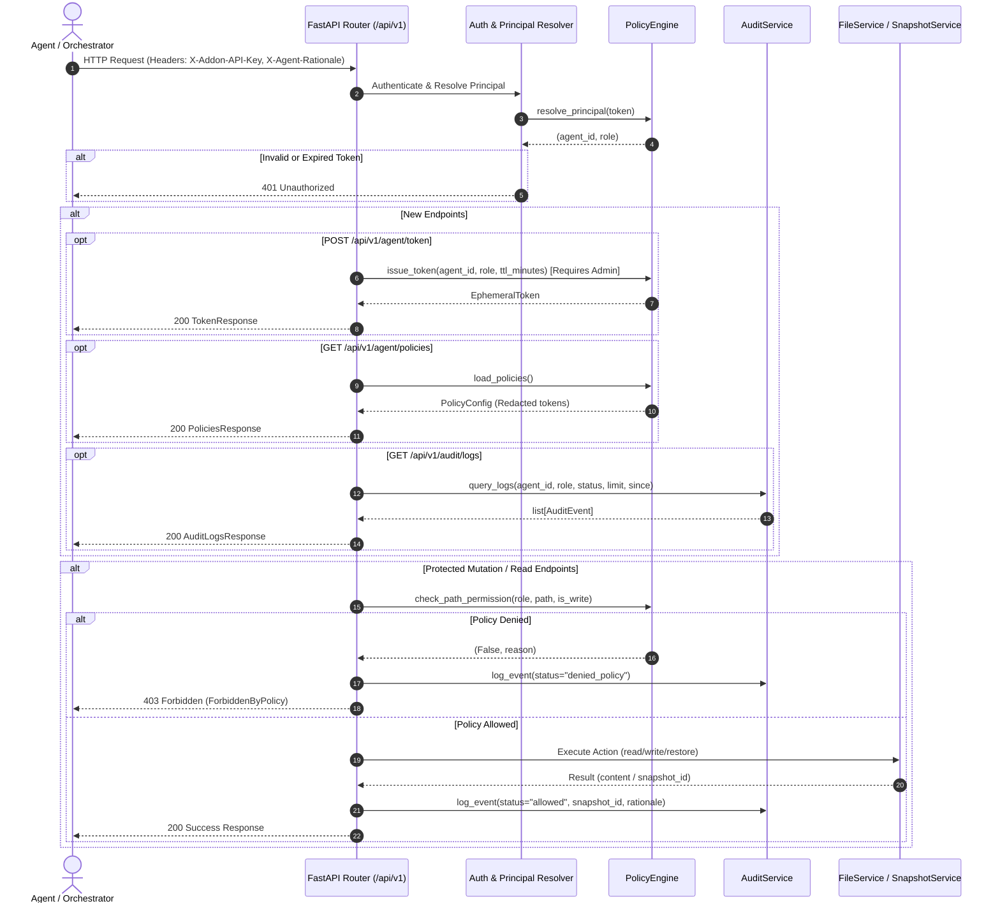

# Design Specification: Policy Enforcement Integration, Audit Endpoints, and Ephemeral Tokens

- **Date**: 2026-09-19
- **Issue**: [#3 Integrate policy enforcement, audit endpoints, and ephemeral tokens](https://github.com/sserhii-tech/home-assistant-mcp/issues/3)
- **Status**: Draft Spec
- **Target Repository**: `sserhii-tech/home-assistant-mcp`
- **Subsystems Affected**: `ha-mcp-helper` (`app.core`, `app.api`, `app.services`)

---

## 1. Overview & Objectives

Issue #3 integrates the standalone `PolicyEngine` (Issue #1) and `AuditService` (Issue #2) into the FastAPI addon server (`ha-mcp-helper`).

### Goals:
1. **Dynamic Ephemeral Tokens**: Allow Master Key / Admin callers to issue time-bounded scoped agent tokens (`sec_agent_ephem_<hex>`) valid for `ttl_minutes`.
2. **New Management Endpoints**:
   - `GET /api/v1/audit/logs`: Filter and return audit log entries.
   - `POST /api/v1/agent/token`: Issue temporary scoped tokens.
   - `GET /api/v1/agent/policies`: Return active roles and agent mappings (with token values redacted).
3. **Policy Enforcement on Existing Endpoints**:
   - Intercept `/api/v1/file/read`, `/api/v1/file/write`, and `/api/v1/backup/restore` with policy and security checks.
   - Return `HTTP 403 Forbidden` with descriptive JSON details (`ForbiddenByPolicy` or security rejection) on violations.
4. **Audit Trail Recording**:
   - Record every file read, file write, backup restore, policy denial, and security block into `.audit/audit.jsonl`.
   - Capture `X-Agent-Rationale` header and pass it to both pre-edit snapshots and audit log records.
5. **100% Statement & Branch Test Coverage**: Maintain full coverage across all touched modules (`app.core.policy`, `app.core.security`, `app.core.config`, `app.services.audit_service`, and API endpoints in `tests/test_api.py`).

---

## 2. Architecture & Data Flow



---

## 3. Detailed Component Designs

### 3.1 Ephemeral Token Model & Engine Extensions (`app/core/policy.py`)

#### Model: `EphemeralToken`
```python
class EphemeralToken(BaseModel):
    token: str
    agent_id: str
    role: str
    expires_at: str  # ISO 8601 UTC timestamp
    created_at: str  # ISO 8601 UTC timestamp
```

#### Extensions in `PolicyEngine`:
- In-memory thread-safe dictionary: `self._ephemeral_tokens: dict[str, EphemeralToken] = {}` guarded by `self._token_lock = threading.Lock()`.
- Method `issue_token(self, agent_id: str, role: str, ttl_minutes: int = 60) -> EphemeralToken`:
  - Validate that `role` exists in `self.load_policies().roles`. If not, raise `ValueError(f"Role '{role}' is not defined in policies")`.
  - Validate `ttl_minutes` (1 <= ttl_minutes <= 1440).
  - Generate secure token: `f"sec_agent_ephem_{uuid.uuid4().hex}"`.
  - Calculate `expires_at = (datetime.now(timezone.utc) + timedelta(minutes=ttl_minutes)).isoformat()`.
  - Store in `_ephemeral_tokens` and return `EphemeralToken`.
- Update `resolve_principal(self, token: str | None) -> tuple[str | None, str | None]`:
  1. Master API key check -> `("master", "admin")`
  2. Ephemeral tokens check:
     - Check token against `_ephemeral_tokens`. If found:
       - Parse `expires_at`. If `now < expires_at`, return `(token_obj.agent_id, token_obj.role)`.
       - If expired, delete from `_ephemeral_tokens` and return `(None, None)`.
  3. Static configured agents in `ha_ai_policies.yaml` -> `(agent_id, agent.role)`
  4. Default -> `(None, None)`

---

### 3.2 FastAPI Authentication & Dependency Injection (`app/core/config.py` & `app/core/dependencies.py`)

#### Dependencies:
- `get_policy_engine() -> PolicyEngine`: Returns singleton or request-scoped `PolicyEngine` configured with `config_root` and `master_api_key`.
- `get_audit_service() -> AuditService`: Returns singleton or request-scoped `AuditService` configured with `audit_dir = config_root / ".audit"`.
- `get_current_principal(x_addon_api_key: str = Header(..., alias="X-Addon-API-Key"), policy_engine: PolicyEngine = Depends(get_policy_engine)) -> tuple[str, str]`:
  - Calls `agent_id, role = policy_engine.resolve_principal(x_addon_api_key)`.
  - If `agent_id is None` or `role is None`, raises `HTTPException(status_code=401, detail="Invalid or expired API token")`.
  - Returns `(agent_id, role)`.
- `get_agent_rationale(x_agent_rationale: str | None = Header(default="", alias="X-Agent-Rationale")) -> str`:
  - Returns rationale header or empty string.

---

### 3.3 Schemas (`app/api/schemas.py`)

```python
class IssueTokenRequest(BaseModel):
    agent_id: str
    role: str
    ttl_minutes: int = 60

class IssueTokenResponse(BaseModel):
    agent_id: str
    role: str
    token: str
    expires_at: str

class AgentSummary(BaseModel):
    role: str
    description: str = ""

class PoliciesResponse(BaseModel):
    roles: dict[str, RoleDefinition]
    agents: dict[str, AgentSummary]

class AuditLogsResponse(BaseModel):
    total_events: int
    events: list[AuditEvent]
```

---

### 3.4 API Routes Implementation

#### A. New Route Module: `app/api/routes/agent.py`
- `POST /api/v1/agent/token`:
  - Requires `principal[1] == "admin"` (or master caller). If not admin, raises `HTTP 403 Forbidden`.
  - Calls `policy_engine.issue_token(req.agent_id, req.role, req.ttl_minutes)`.
  - Logs `AuditEvent` (`action="token_issue"`, `status="allowed"`).
  - Returns `IssueTokenResponse`.
- `GET /api/v1/agent/policies`:
  - Accessible to authenticated callers.
  - Loads policies via `policy_engine.load_policies()`.
  - Sanitizes `agents` dictionary to map `agent_id` to `AgentSummary(role=..., description=...)` without exposing secret static tokens.
  - Returns `PoliciesResponse`.

#### B. Audit Query Route: `app/api/routes/audit.py` (or integrated into `routes/logs.py` / `routes/audit.py`)
- `GET /api/v1/audit/logs`:
  - Query parameters:
    - `agent_id: str | None = None`
    - `role: str | None = None`
    - `status: str | None = None`
    - `limit: int = 50`
    - `since: str | None = None`
  - Evaluates tool permission `ha_audit_get_logs` for `principal.role`. If denied, returns `403 Forbidden`.
  - Calls `audit_service.query_logs(agent_id=..., role=..., status=..., limit=..., since=...)`.
  - Returns `AuditLogsResponse(total_events=len(events), events=events)`.

#### C. Protected Mutation & Read Routes (`routes/files.py`, `routes/backups.py`)
- `POST /api/v1/file/read`:
  - `allowed, reason = policy_engine.check_path_permission(role, req.path, is_write=False)`
  - If not allowed:
    - Log audit event: `status="denied_policy"`, `reason=reason`.
    - Raise `HTTPException(status_code=403, detail={"error": "ForbiddenByPolicy", "message": reason, "rule_violated": reason})`.
  - If allowed:
    - Read file via `FileService.read_file(...)`.
    - Log audit event: `status="allowed"`, `reason="Allowed by policy"`.
    - Return `FileReadResponse`.
- `POST /api/v1/file/write`:
  - `allowed, reason = policy_engine.check_path_permission(role, req.path, is_write=True)`
  - If not allowed:
    - Log audit event: `status="denied_policy"`, `reason=reason`, `rationale=rationale`.
    - Raise `HTTPException(status_code=403, detail={"error": "ForbiddenByPolicy", "message": reason, "rule_violated": reason})`.
  - If allowed:
    - Pass `label=rationale or req.label` to `FileService.write_file(...)`.
    - Obtain `snapshot_id`.
    - Log audit event: `status="allowed"`, `snapshot_id=snapshot_id`, `rationale=rationale`.
    - Return `FileWriteResponse`.
- `POST /api/v1/backup/restore`:
  - Check tool permission `ha_system_restore_backup` for `role`.
  - If not allowed:
    - Log audit event: `status="denied_policy"`.
    - Raise `HTTPException(status_code=403, detail={"error": "ForbiddenByPolicy", "message": "Restore denied by policy", "rule_violated": "ha_system_restore_backup denied"})`.
  - If allowed:
    - Perform restore via `SnapshotService.restore_snapshot(...)`.
    - Log audit event: `status="allowed"`, `snapshot_id=req.snapshot_id`.
    - Return `BackupRestoreResponse`.
- On `SecurityException` (e.g. jailing / hardcoded deny-lists):
  - Log audit event: `status="denied_security"`.
  - Raise `HTTPException(status_code=403, detail=str(err))`.

---

## 4. Test Strategy

1. **Unit & API Integration Tests (`tests/test_api.py`)**:
   - `test_issue_token_admin_success`: Admin issues ephemeral token with TTL; token can authenticate and access authorized routes.
   - `test_issue_token_non_admin_forbidden`: Non-admin caller receives 403 when attempting to issue tokens.
   - `test_ephemeral_token_expiration`: Expired ephemeral token returns 401 Unauthorized.
   - `test_get_agent_policies`: Returns roles and agent summaries with redacted token strings.
   - `test_audit_query_endpoint`: Filters logs by status, agent_id, role, limit, and since.
   - `test_file_read_policy_enforcement`: Read allowed for permitted paths, 403 ForbiddenByPolicy for unpermitted paths, audit events logged for both.
   - `test_file_write_policy_enforcement`: Write allowed for permitted paths, 403 for read-only / unpermitted paths, pre-edit snapshots and rationale attached to audit event.
   - `test_backup_restore_policy_enforcement`: Restrict restore to authorized roles.
   - `test_rationale_header_propagation`: `X-Agent-Rationale` recorded in both snapshot metadata and audit log.
2. **Coverage Goal**: 100% statement and branch coverage across `ha-mcp-helper` enforced by `--cov-fail-under=100`.
