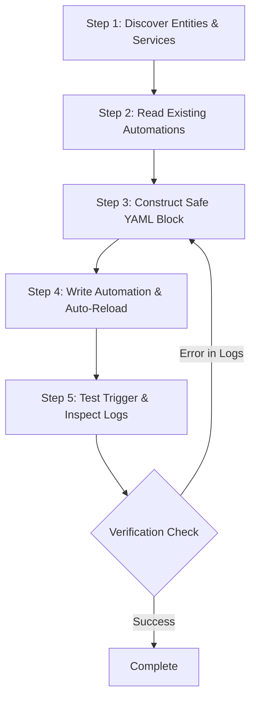

# Home Assistant Automation Builder Skill

## Overview

The `ha-automation-builder` skill provides an end-to-end Standard Operating Procedure (SOP) for drafting, writing, validating, and testing Home Assistant automations and scripts. It enforces best practices such as unique ID assignment, syntax validation, automated snapshot generation before disk modification, live entity validation, and post-deployment trigger execution verification.

---

## Workflow & Steps



### Step 1: Discover Entity IDs & Services
Before authoring automation logic, discover all target entities, their current states, supported attributes, and service domains.
- Use `ha_system_list_entities` to look up sensor names, switch entity IDs, zone entities, or input helpers.
- Verify entity domains (e.g. `binary_sensor.front_door`, `light.hallway`, `climate.thermostat`).

```json
// Example call: ha_system_list_entities
{
  "domain_filter": "binary_sensor",
  "search_query": "motion"
}
```

### Step 2: Read Existing Automations & Avoid Collisions
Examine existing automations to avoid duplicate aliases, conflicting triggers, or ID collisions.
- Use `ha_automation_list` with domain `automation` (or `script` / `scene`) to view active entity IDs, friendly names, and trigger times.
- Use `ha_automation_read` with a specific automation ID or alias to inspect existing YAML structure and conventions.

```json
// Example call: ha_automation_list
{
  "domain": "automation"
}

// Example call: ha_automation_read
{
  "automation_id": "night_light_auto_off"
}
```

### Step 3: Construct Safe YAML Automation Blocks
Structure the automation with clear metadata, robust triggers, defensive conditions, and appropriate execution modes.
- **Unique Identifier**: Always assign a deterministic or timestamped `id` (e.g. `id: '1725100000123'` or `id: auto_living_room_motion`).
- **Alias & Description**: Provide a clear human-readable `alias` and `description`.
- **Triggers**: Define precise triggers with thresholds or duration (e.g. `for: { minutes: 5 }`).
- **Conditions**: Use conditions to filter execution (e.g. sun elevation, state conditions, time ranges).
- **Actions**: Utilize official Home Assistant service targets (`action:` / `service:`) and avoid deprecated syntax.
- **Execution Mode**: Choose the appropriate `mode`:
  - `single`: Default, drops concurrent triggers.
  - `restart`: Ideal for motion timers (resets timer on new motion).
  - `queued`: Enqueues triggers up to `max`.
  - `parallel`: Executes independently up to `max`.

```yaml
- id: "auto_hallway_motion_light"
  alias: "Hallway: Motion-Activated Nightlight"
  description: "Turn on hallway light on motion after sunset and turn off after 3 minutes of no motion."
  mode: restart
  trigger:
    - platform: state
      entity_id: binary_sensor.hallway_motion
      to: "on"
  condition:
    - condition: state
      entity_id: sun.sun
      state: "below_horizon"
  action:
    - action: light.turn_on
      target:
        entity_id: light.hallway
      data:
        brightness_pct: 30
    - wait_for_trigger:
        - platform: state
          entity_id: binary_sensor.hallway_motion
          to: "off"
          for:
            minutes: 3
    - action: light.turn_off
      target:
        entity_id: light.hallway
```

### Step 4: Write Automation with Auto-Reload & Snapshot
Write the automation block to `automations.yaml` safely.
- Use `ha_automation_write` providing the `automation_id`, `yaml_code`, and a descriptive `label`.
- Note: `ha_automation_write` automatically creates a safety snapshot in the Addon storage, validates YAML syntax, appends or updates the target automation block, and triggers `automation.reload`.

```json
// Example call: ha_automation_write
{
  "automation_id": "auto_hallway_motion_light",
  "label": "Add hallway nightlight motion automation",
  "yaml_code": "- id: 'auto_hallway_motion_light'\n  alias: 'Hallway: Motion-Activated Nightlight'\n  mode: restart\n  trigger:\n    - platform: state\n      entity_id: binary_sensor.hallway_motion\n      to: 'on'\n  action:\n    - action: light.turn_on\n      target:\n        entity_id: light.hallway\n",
  "rationale": "Creating a safety light that triggers at night automatically."
}
```

### Step 5: Test Trigger & Inspect Execution Logs
Validate that the newly registered automation triggers properly and executes its action sequence without runtime errors.
- Use `ha_automation_trigger` with `entity_id` (e.g. `automation.hallway_motion_activated_nightlight`).
- Use `ha_system_get_logs` to tail the latest logs and confirm clean execution with zero template errors or missing service faults.

```json
// Example call: ha_automation_trigger
{
  "entity_id": "automation.hallway_motion_activated_nightlight"
}

// Example call: ha_system_get_logs
{
  "lines_count": 50
}
```

---

## Tool Reference

| Tool | Purpose | Key Parameters |
| :--- | :--- | :--- |
| `ha_system_list_entities` | Query entity IDs, states, attributes | `domain_filter`, `search_query` |
| `ha_automation_list` | List automations, scripts, or scenes | `domain` |
| `ha_automation_read` | Fetch YAML block of an automation | `automation_id` |
| `ha_automation_write` | Validate, snapshot, write YAML & reload | `automation_id`, `yaml_code`, `label`, `rationale` |
| `ha_automation_trigger` | Execute automation trigger manually | `entity_id` |
| `ha_system_get_logs` | Retrieve sanitized core log lines | `lines_count` |

---

## Safety Rules & Best Practices

1. **Unique ID Requirement**: Every automation block MUST have an explicit `id` field to enable UI editing and targeted updates.
2. **Deterministic Reloading**: Never rely on full Home Assistant restarts for automation testing; use `ha_automation_write`'s built-in service reload.
3. **Log Verification Gate**: Never declare an automation complete without checking `ha_system_get_logs` for template or service execution warnings.
4. **Appropriate Mode Selection**: Use `mode: restart` for motion/timer automations and `mode: single` or `mode: queued` for security/alert automations.
5. **Sandboxed Roles & Audit Logs**: Always provide a descriptive `rationale` parameter when deploying automations, as this is logged securely. If delegating to a coding subagent, invoke them with the restricted `automation_builder` role via `ha_agent_issue_token` to enforce scope safety.
