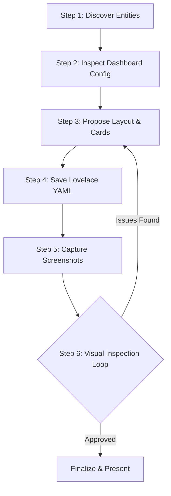

# Home Assistant Dashboard Designer Skill

## Overview

The `ha-dashboard-designer` skill provides a complete Standard Operating Procedure (SOP) for creating, modifying, and polishing Home Assistant Lovelace dashboards with AI-driven visual validation. By combining entity discovery, configuration management with automatic snapshot safety, and headless Playwright screenshot rendering, this skill ensures dashboards are aesthetically refined, responsive across devices, and functional.

---

## Workflow & Steps



### Step 1: Query Available Entities
Before designing or modifying any dashboard cards, discover the available entities, their domains, states, friendly names, and device classes.
- Use `ha_system_list_entities` with domain filters (e.g. `light`, `climate`, `sensor`, `switch`, `media_player`) or search terms.
- Verify entity availability and state types (e.g. numeric sensors, binary on/off states, list attributes).

```json
// Example call: ha_system_list_entities
{
  "domain_filter": "climate",
  "search_query": "living_room"
}
```

### Step 2: Inspect Existing Dashboard Configuration
Inspect the current dashboard configuration to maintain theme consistency, title naming conventions, badge configurations, and view hierarchy.
- Use `ha_dashboard_get_config` with the target `dashboard_slug` (e.g. `lovelace` for default or custom slugs like `dashboard-energy`).
- Analyze existing views, card types, custom themes, and column layouts.

```json
// Example call: ha_dashboard_get_config
{
  "dashboard_slug": "lovelace"
}
```

### Step 3: Propose Card Layout & Design
Design card layouts tailored to the user requirements and device constraints:
- **Card Selection**:
  - **Tile Card**: Modern HA standard for lights, switches, media players with feature controls.
  - **Mushroom Cards**: Minimalist, touch-friendly UI for room summaries, chips, and climate.
  - **Grid & Stacks**: `grid`, `horizontal-stack`, and `vertical-stack` for structured alignment.
  - **Glance & Entities**: Compact summaries for sensors (temperatures, battery levels).
  - **ApexCharts & Gauges**: Historical trends, energy metrics, and analog gauges.
  - **Conditional Cards**: Dynamic cards that appear only when specific states match (e.g. doors open, low battery).
- **Responsive Guidelines**:
  - Use 2-4 columns on desktop layouts.
  - Ensure single-column or wrapping behavior on mobile screens.
  - Group cards logically by room or domain.

### Step 4: Save Lovelace YAML Configuration
Apply the updated dashboard configuration safely.
- Use `ha_dashboard_save_config` supplying the YAML configuration, target `dashboard_slug`, and a descriptive `label`.
- Note: `ha_dashboard_save_config` automatically creates a safety snapshot before applying modifications and performs YAML schema validation.

```json
// Example call: ha_dashboard_save_config
{
  "dashboard_slug": "lovelace",
  "label": "Add living room climate tile and energy gauge",
  "config_yaml": "title: Home\nviews:\n  - title: Main\n    path: main\n    cards:\n      - type: tile\n        entity: light.living_room\n",
  "rationale": "Adding climate and energy visualizations for better visibility."
}
```

### Step 5: Capture Rendered Screenshots
Verify the visual rendering of the updated dashboard using the headless Playwright browser.
- Use `ha_dashboard_render_screenshot` with the target `url_path` (e.g. `lovelace/0`, `dashboard-energy`).
- Always test across multiple device presets:
  - `desktop` (1920x1080)
  - `mobile` (375x812)
  - `tablet` (768x1024)
- Test both light and dark modes when relevant using `dark_mode: true`.
- Use `element_selector` when focusing on a specific card component.

```json
// Example call: ha_dashboard_render_screenshot
{
  "url_path": "lovelace/0",
  "device_preset": "desktop",
  "dark_mode": false
}
```

### Step 6: Visual Inspection Loop & Iteration
Analyze the captured screenshot image using multimodal vision inspection:
1. **Alignment & Grid Symmetry**: Are card borders aligned? Are heights balanced across columns?
2. **Typography & Readability**: Are labels truncated? Is text overflowing container bounds?
3. **Icons & States**: Are MDI icons rendering correctly? Are active entity states visually distinct?
4. **Color & Contrast**: Do accent colors match the background theme in both light and dark mode?
5. **Mobile Responsiveness**: Do horizontal stacks wrap cleanly without clipping horizontal scrollbars?

*If any visual flaw or layout inconsistency is detected, return to Step 3, adjust the Lovelace YAML, re-save, and re-capture until the dashboard achieves optimal visual fidelity.*

---

## Tool Reference

| Tool | Purpose | Key Parameters |
| :--- | :--- | :--- |
| `ha_system_list_entities` | Discover entities & states | `domain_filter`, `search_query` |
| `ha_dashboard_get_config` | Fetch Lovelace dashboard YAML/JSON | `dashboard_slug` |
| `ha_dashboard_save_config` | Snapshot, validate, and write dashboard | `config_yaml`, `dashboard_slug`, `label`, `rationale` |
| `ha_dashboard_render_screenshot` | Headless Playwright visual capture | `url_path`, `device_preset`, `dark_mode`, `element_selector` |

---

## Safety Rules & Best Practices

1. **Automatic Snapshot Preservation**: Never edit Lovelace files directly outside of `ha_dashboard_save_config`, ensuring an automatic snapshot ID is always generated for rollback.
2. **Multi-Viewport Testing**: Every dashboard modification must be verified on both `desktop` and `mobile` presets before marking complete.
3. **Graceful Entity Fallbacks**: Use conditional cards or friendly names so cards remain visually appealing even when sensors are temporarily unavailable.
4. **Non-Destructive View Updates**: When adding new features, prefer creating dedicated views or sub-views rather than overwriting existing user dashboards without request.
5. **Sandboxed Roles & Audit Logs**: Always provide a descriptive `rationale` parameter when saving config, as this is logged securely. If delegating to a UI subagent, invoke them with the restricted `dashboard_designer` role via `ha_agent_issue_token` to enforce scope safety.
