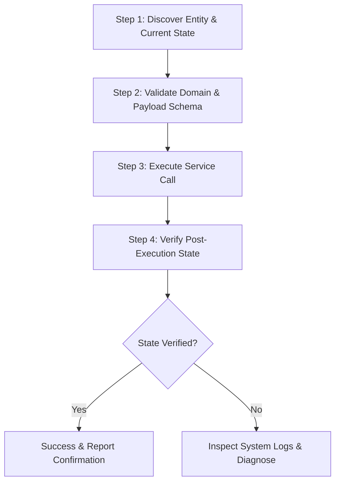

# Home Assistant Device Controller Skill

## Overview

The `ha-device-controller` skill defines the Standard Operating Procedure (SOP) for querying real-time smart device states, invoking Home Assistant domain services (lights, switches, climate, media players, covers), and validating that the target hardware correctly transitions state.

---

## Workflow & Steps



### Step 1: Discover Entity & Current State
Before sending control commands or invoking services, locate the exact target entity ID and inspect its current attributes.
- Use `ha_system_list_entities` with `domain_filter` (e.g. `light`, `switch`, `climate`) or `search_query`.
- Verify the current `state` (e.g., `off` vs `on`), supported color modes, preset modes, or available features.

```json
// Example call: ha_system_list_entities
{
  "domain_filter": "light",
  "search_query": "office"
}
```

### Step 2: Validate Domain & Payload Schema
Construct the service invocation payload matching Home Assistant Core service specifications.
- Common services include:
  - `light.turn_on`, `light.turn_off`, `light.toggle` (with `brightness`, `rgb_color`, `color_temp_kelvin`)
  - `switch.turn_on`, `switch.turn_off`, `switch.toggle`
  - `climate.set_temperature`, `climate.set_hvac_mode` (with `temperature`, `hvac_mode`)
  - `cover.open_cover`, `cover.close_cover`, `cover.set_cover_position`
  - `homeassistant.update_entity`, `homeassistant.reload_all`

### Step 3: Execute Service Call
Invoke the service using `ha_system_call_service`.
- Provide the `domain`, `service`, and `service_data` payload.

```json
// Example call: ha_system_call_service
{
  "domain": "light",
  "service": "turn_on",
  "service_data": {
    "entity_id": "light.office_light",
    "brightness": 200
  },
  "rationale": "Turning on the lights as part of the morning routine."
}
```

### Step 4: Verify Post-Execution State
Confirm that the physical device or software entity acknowledged the command and changed state.
- Re-query `ha_system_list_entities` with `search_query` targeting the entity.
- Compare `last_changed` and `state` against expected outcome.
- If the entity remains unchanged or reports `unavailable`, tail recent logs with `ha_system_get_logs` to diagnose integration communication errors.

---

## Tool Reference

| Tool | Purpose | Key Parameters |
| :--- | :--- | :--- |
| `ha_system_list_entities` | Discover entities and inspect live states | `domain_filter`, `search_query` |
| `ha_system_call_service` | Call any Home Assistant domain service | `domain`, `service`, `service_data`, `rationale` |
| `ha_system_get_logs` | Inspect system error logs on failures | `lines_count`, `source` |
| `ha_system_health` | Verify API and integration connectivity | *(none)* |

---

## Safety Rules & Best Practices

1. **Verify Before Execution**: Always confirm entity identity with `ha_system_list_entities` before triggering destructive or high-energy actions (heaters, locks, garage doors).
2. **Post-State Validation**: Never assume a service call succeeded solely based on HTTP 200; verify the entity `state` afterwards.
3. **Graceful Error Handling**: If a device fails to respond, inspect `ha_system_get_logs` for Zigbee/Z-Wave/Wi-Fi timeout errors before retrying in a loop.
4. **Sandboxed Roles & Audit Logs**: Always provide a descriptive `rationale` parameter when mutating state, as this is logged securely by the Audit service. Use ephemeral tokens via `ha_agent_issue_token` with narrow roles if delegating this task to a subagent.
