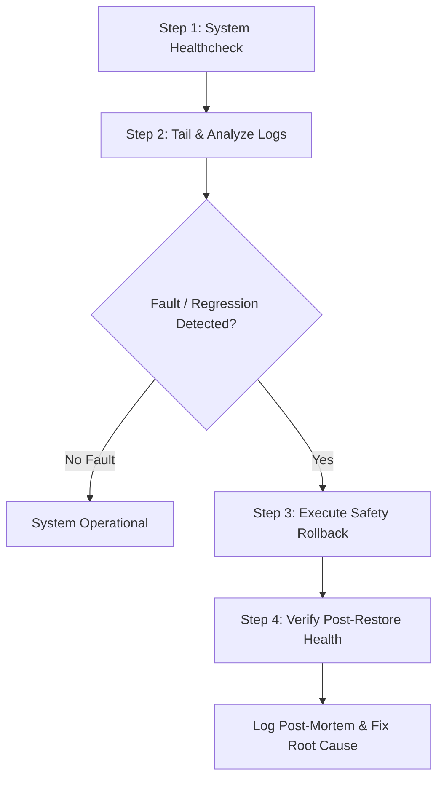

# Home Assistant Troubleshooter Skill

## Overview

The `ha-troubleshooter` skill establishes a structured, safety-first Standard Operating Procedure (SOP) for diagnosing system faults, analyzing sanitized log traces, detecting configuration syntax errors or integration crashes, and performing instant, non-destructive snapshot rollbacks in Home Assistant.

---

## Workflow & Steps



### Step 1: System Healthcheck
Initiate diagnostics by checking the operational status of both the Home Assistant Core API and the AI Addon helper daemon.
- Use `ha_system_health` to evaluate connectivity, component reachability, and API response latencies.
- Determine whether Home Assistant is running in normal, degraded, or recovery state.

```json
// Example call: ha_system_health
{}
```

### Step 2: Tail & Analyze Sanitized Logs
Inspect system logs to identify tracebacks, deprecation warnings, unhandled exceptions, template rendering faults, or integration connection failures.
- Use `ha_system_get_logs` specifying `lines_count` (e.g. 50-200 lines) and optionally `source` (`core`, `supervisor`, `all`).
- Note: System logs are automatically sanitized by the Addon backend to redact sensitive tokens, passwords, and authorization headers.
- Categorize observed errors:
  - **YAML / Syntax Errors**: Invalid keys, missing indentation, or schema validation failures in `configuration.yaml`, `automations.yaml`, or dashboards.
  - **Entity / Device Unavailable**: Missing integrations, offline Zigbee/Z-Wave nodes, or changed entity IDs.
  - **Service Call Failures**: Invocation of nonexistent services or missing target parameters.

```json
// Example call: ha_system_get_logs
{
  "lines_count": 100,
  "source": "all"
}
```

### Step 3: Execute Safety Rollback or Manual Backup
When an edit, automation change, or dashboard update leads to instability, regression, or syntax errors, perform an immediate safety rollback.
- If performing experimental diagnostics before a fix, create a pre-fix checkpoint using `ha_system_create_backup` with a descriptive `label`.
- If an issue was introduced by a previous tool call, locate the corresponding `snapshot_id` from the tool response or snapshot history.
- Use `ha_system_restore_backup` with `snapshot_id` to restore the file atomically. The Addon automatically creates a safety backup of current disk state before restoring.

```json
// Example call: ha_system_create_backup
{
  "label": "Pre-troubleshooting configuration checkpoint",
  "rationale": "Saving state before attempting to fix syntax error in configuration.yaml"
}

// Example call: ha_system_restore_backup
{
  "snapshot_id": "snap_20260831_093000_automations_yaml",
  "rationale": "Rolling back because the new automation caused a boot loop."
}
```

### Step 4: Verify Post-Restore System Health
After executing a rollback or applying a corrective patch, verify that the system has returned to full operational capacity.
- Re-run `ha_system_health` to verify that API and daemon health check reports are `ok`.
- Tail recent logs with `ha_system_get_logs` to ensure error loops and exception tracebacks have cleared.
- Query `ha_audit_get_logs` to ensure no `denied_policy` or security alerts were triggered during the fault.

```json
// Example call: ha_system_health
{}

// Example call: ha_system_get_logs
{
  "lines_count": 50
}
```

---

## Tool Reference

| Tool | Purpose | Key Parameters |
| :--- | :--- | :--- |
| `ha_system_health` | Query HA Core API & Addon daemon health | *(none)* |
| `ha_system_get_logs` | Fetch sanitized tail of HA core & supervisor logs | `lines_count`, `source` |
| `ha_system_create_backup` | Create named manual snapshot backup | `label`, `rationale` |
| `ha_system_restore_backup` | Restore configuration from snapshot ID | `snapshot_id`, `rationale` |
| `ha_audit_get_logs` | Query audit logs for recent system changes | `limit`, `status` |

---

## Safety Rules & Best Practices

1. **Non-Destructive Restoration**: All restore operations conducted via `ha_system_restore_backup` automatically preserve the overwritten version in a safety snapshot.
2. **Sanitized Output Awareness**: `ha_system_get_logs` redacts secrets; never attempt to bypass log sanitization to inspect raw credentials.
3. **Rollback Over Patching Broken States**: When an unverified configuration breaks critical automations, roll back to the last known good snapshot before attempting redesigns.
4. **Mandatory Post-Restore Verification**: Always verify both `ha_system_health` and `ha_system_get_logs` after any restore or configuration repair.
5. **Sandboxed Roles & Audit Logs**: Always provide a descriptive `rationale` parameter when backing up or restoring configurations, as this is logged securely. If delegating to a diagnostics subagent, invoke them with the restricted `diagnostics` role via `ha_agent_issue_token` to enforce scope safety.
